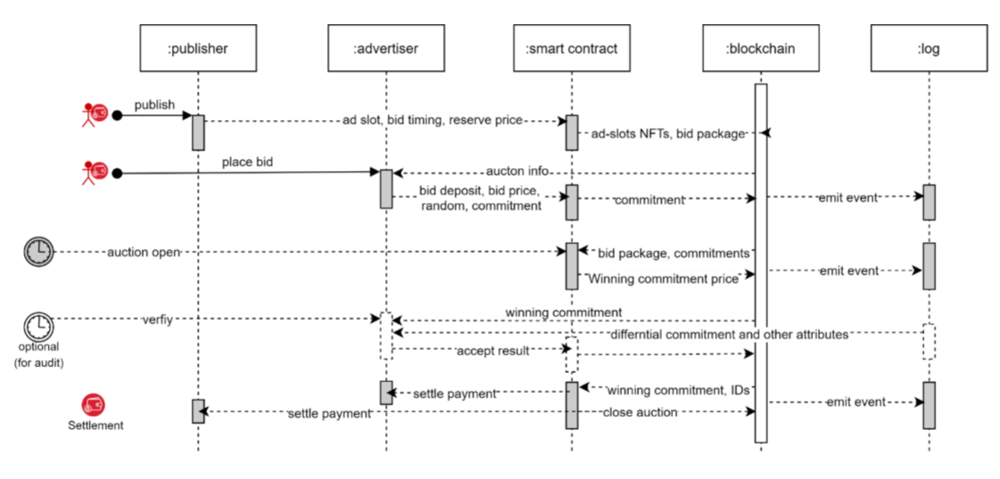

# Bidding and Auction layer

After collecting all the inventory and bids, the main aim of the auction is to decide on the resource allocation such as the ranking of advertisements and the correct pricing.

We propose a combinatorial auction system as it allows selling a set of ad slots to multiple advertisers. Combinatorial auctions have been a subject of active research (Porter et al., 2003), (Bichler, 2010) as they allow negotiations on a set of heterogeneous items with prices defined for a specific subset of the items for auctions.

A combinatorial clock (CC) auction is proposed as the implementation scheme since it allows several properties of single time bid auctions to be observed in combinatorial auctions. These properties include allocative efficiency, revenue increase, incentive compatibility, and robustness against collusion among others. The scheme uses blockchain technology, as well as a commitment algorithm, smart contracts, and zero-knowledge proof, to secure bidder information from leaking and anonymously verify auction results with all bidders without the use of a third-party auctioneer. Cros is committed to collaborating with the community to improve the capabilities of this platform to support other combinatorial bidding formats in the future, as well as providing a variety of implementations based on academic and research work in this field. (Galal and Youssef, 2018), (Li and Xue, 2021).

## Auction goals

### Inputs

1. From publishers: The advertising inventory is structured as a set of slots, each of which is defined by a time range on a game, event, or programme, as well as some fundamental parameters.
2. From advertisers: All advertisement campaigns that are interested in the inventory are collected here. The daily budget and CPM for each slot are the most basic sources of information provided for each campaign. Additional limitations and preferences can be used to define bid packages or bundles.

### Output

1. The rank: The advertisers will receive information about the auction rank, which will allow them to display creative advertisement content at a specified probability across all qualified ad-assets in the games.
2. Pricing: The pricing indicates how much each advertiser charged for in CPM.

## Protocol description

The protocol outlines a set of smart contracts that encompass NFT minting for advertisement slots, advertisement content, and the entire auction design. The following design properties are outlined considering auction design is the most significant design element for the overall protocol:

1. Bid’s Privacy and Binding: During the bidding phase, the submitted bids and lost bids are hidden from the public and other bidders to prevent bidders' values from being used against them in future auctions. Bidders are obligated to their bids; they cannot deny or amend their bids once they have committed.
2. Public Verifiability: Any individual can verify the correctness of the auction winner proof.
3. Fairness: Rational parties are obligated to follow the proposed protocol to avoid being financially penalized.

The bid price auction is a key component of the overall product design. It is based on a bid auction format designed with a commitment algorithm, a Zero Knowledge Proof (ZKP) scheme, and a set of smart contracts to secure bidder information from leaking and anonymously verify auction results by any or all bidders. The overall setup can be represented in the table below.

| Notation | Meaning                                                                        |
| -------- | ------------------------------------------------------------------------------ |
| `bi`     | Bidder “i” where i belongs K                                                   |
| `I`      | Set of all bidders \[1,....n]                                                  |
| `K`      | Set of all ad slots \[1,...k]                                                  |
| `pk*`    | Set of all ad slots \[1,...k]                                                  |
| `pki`    | The bid price of the bidder is for item ‘k’.                                   |
| `ri`     | The random blinding factor of bidder i.                                        |
| `G, H`   | The generating points on specific elliptic curves to encrypt the bid price pi. |
| `Cki`    | Commitment price of price pki.                                                 |
| `Ck*`    | Commitment price of the winning price.                                         |
| `C^k`i   | Differential commitment price of C\* and Cki.                                  |
| `pks`    | Public key of the smart contract.                                              |

## Bid Pricing Hiding

The auction scheme should have a feature that prevents the verifier from knowing anything about the data until the commitment is revealed. At the same time, the bidder should not be allowed to change the commitment value once it has been revealed. To keep the bidders' bid prices hidden, we deploy a cryptographic commitment system. The scheme is designed up in a way that the data can be temporarily hidden, allowing it to be verified even if the prover (bidder who commits to a value) or the verifier are both biased.

We use Pedersen Commitment (Pedersen, 1991) which is based on Elliptic Curve Cryptography (ECC) (Miller, 1985) and is used to generate a commitment for a bid price “p” shown in Equation (1).

𝐶(𝑝, 𝑟) = 𝑟 ×𝐺 + 𝑝 ×\_H\_

Even if private data (bid price "p") remains same, the final commitment "C" will change if a random blinding factor "r" is introduced. Pedersen Commitment is a preferable alternative for bid pricing hiding and binding because of this property. The smart contract-generated G and H parameters are two generating points on a specific elliptic curve that provide consensus information to all auction participants. The following is a description of how Pedersen Commitment will be utilized in the auction scheme:

1. The bidder “bi " gets a random blinding factor “ri” and calls the Equation (1) function C(pi , ri) to produce commitment price Ci (i ϵ I).
2. The bidder “bi” publishes Ci to the blockchain and sends E(pi , ri , pks) to the smart contract account. Here “E ( )” is the encryption function to encrypt pi and ri with pks (public key of the smart contract).
3. When the bid deadline arrives, the smart contract opens the commitment. The commitment C \* bound to the winning price p \* is revealed.
4. The differential commitment Ĉi is calculated (as per Equation 2) and information is emitted as event and logged.

Ĉ𝑖 = ∁\*− ∁𝑖 = (𝑟\* − 𝑟𝑖) × 𝐺 + (𝑝 \* − 𝑝𝑖) ×𝐻

\= 𝑟 \* 𝑖 ×𝐺 + 𝑝 \* 𝑖 ×𝐻

𝑖𝑓 𝑝 \* 𝑖 >= 0, 𝑡ℎ𝑒𝑛 𝑝\* > 𝑝𝑖

## Verification of Bid Results

Bid verification is not a mandatory step, but any party can choose to verify the results for audit or other purposes. We use a combination of Pedersen Commitment's additive homomorphism property and a Zero Knowledge Proof (ZKP) algorithm (Ben-Sasson et al., 2018) to establish the binding relations of distinct values for anonymously verifying bid results without disclosing the content of actual bids (except the winning bid). A non-interactive ZKP that does not require a trusted setup and can prove that a given transaction value is within a positive range would be chosen. In short, we will hide the real bid price with the Pedersen Commitment algorithm, then verify the higher bidding price with the differential commitment price Ĉ𝑖 in Equation (2) using a form of ZKP.

The following are the detailed steps for verification work:

### Step 1

Bidder bi recomputes the differential commitment price Ĉij with published C\* and his own commitment price Ci . Where, _Ĉij = C\* - Ci_

### _Step 2_

Bidder bi compares Ĉij with Ĉj (fetched from the log store).

### Step 3

If Ĉij = Ĉi , then C\_\*\_ can be accepted. The next step is for bidder bi to use chosen ZKP algorithm and Ĉi to confirm that the winning price p\* is higher than his own bid price pi . The proof result is compared with the Boolean flag of comparison fetched from the log store.

### Step 4

The optional verification result by the bidder can be published to the blockchain

## Auction phases

The auction process consists of the following different stages: publish, bid, open, verify and settle. Overall, there are four actors: publishers, advertisers, the smart contract and the blockchain. Firstly, the owner of content platforms publishes the available advertisement slots on the blockchain, and advertisers then submit their bids before the deadline. The interaction between the various actors during the auction process is depicted in Figure 8, which are supported at various stages by the smart contract functions.

<figure><figcaption>
ad-auction sequence
</figcaption></figure>

### Publish phase

The publishers use the publish function in the smart contract to upload inventory (ad-slots) information. The smart contract will verify the user identity before returning the publish authorization to the inventory owner (ad-slot). Remember that the ad-slot inventory ownership is represented by an NFT minted for the publisher. The publisher then sends the smart contract the basic inventory information, auction start and end times, bid security requirements, the smallest number of bidders, and a reserve price (encrypted by a public key of the smart contract). This is mined and saved as a blockchain transaction.

### Bid phase

The bid function in the smart contract will be used by the advertisers who are qualified and permitted to bid from auction start time. Firstly, the bidder’s identity will be verified by the smart contract. The bidder will put a caution deposit of m to the account appointed and supervised by the smart contract. Each bidder bi, provides the bid price pi and a random number ri, which are encrypted by the public key of the smart contract and saved on the blockchain. The bid price, pi will never be revealed by the smart contract. Each bidder bi, calls the Pedersen commitment function to get the commitment price Ci and saves that on the blockchain. The commitment price is encrypted by the private key of the bidder bi such that all the bidders and the publisher of the ad-slots can get the information of Ci by decrypting it with the public key of bi.

### Open phase

At the auction ending time t2, the smart contract counts the bidders attending the auction and checks all bid prices in the auction. If the number of bidders is smaller than n, or all bid prices were smaller than the reserve price pr, the auction is announced as a failed auction. Otherwise, the auction proceeds in the steps outlined subsequently. All bid prices are sorted and the highest bid price p\* is selected as the winning bid price. The commitment price C\* bound to p\* is published to the blockchain by the smart contract. Each differential commitment price C^i is calculated along with the Boolean flag for the comparison p\_\* >\_ pi , these are encrypted with the public key of each bidder by smart contract, emitted as an event and logged.

### Verify phase

This is an optional step, any bidder can choose to verify the results for audit or other purposes, the bidder bi gets the commitment price C \* , the differential commitment price Ĉi and p \*>pi comparison values from the log store. He then recalculates the differential commitment price C \~ i = C\* - Ci and compares C \~ with Ĉ. If they are equal, then the commitment price has been verified by bidder bi . Next, the bidder uses a chosen ZKP algorithm to check p\* > pi with Ĉi , without leaking any information about the winning bid price p\*.

### Settle phase

The smart contract asks the winning bidders to pay the rest of the payment for the ad-slots (p\* - m) to the appointed account and then transfers the full payment p\* to the publisher. The bid security of other bidders is returned to the bidder’s accounts.
