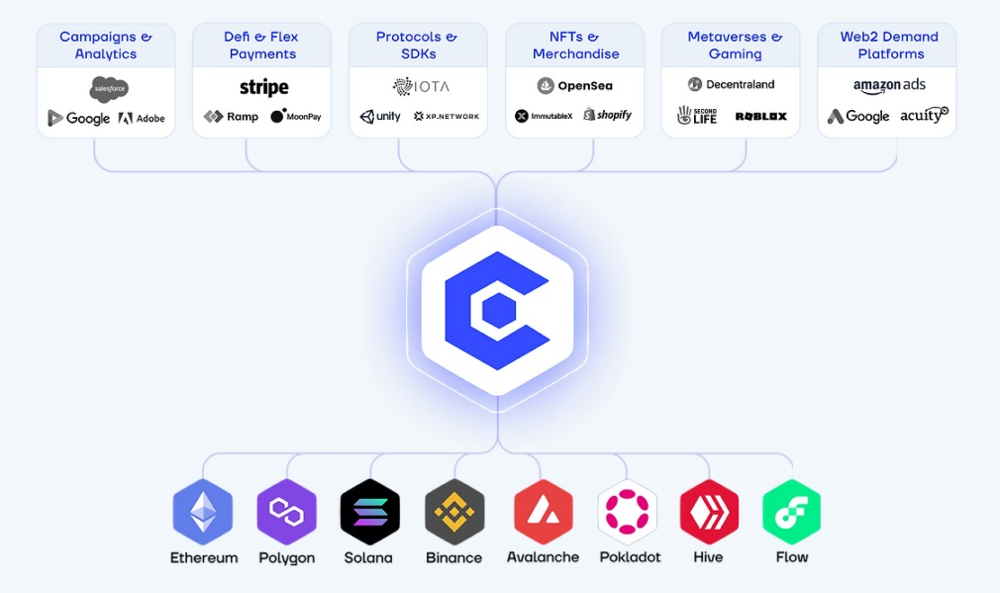

# 🌍 Cros Advertising Ecosystem

A multi-dimensional Cros Advertising platform, designed to be blockchains & partners agnostic.

1. Campaigns & Analytics
2. Defi & Flex Payments
3. Protocols & SDKs
4. NFTs & Merchandise&#x20;
5. Metaverses & Gaming
6. Web2 Demand Platforms
7. Chain agnostic
8. Cros Layer 2 Protocol

<figure><figcaption></figcaption></figure>

### Campaigns & Analytics

Cros Ads Manager that offers supply and demand side capabilities including Whitelabel.&#x20;

The advertiser demand side empowers brands, advertising agencies, and demand side platform aggregators to seamlessly deploy ad campaigns across the metaverse for brands' products and NFT lines. Cros ads manager also includes a comprehensive analytics suite and a social NFTs marketplace to trade ad assets and brands ad creatives NFTs.

And the publisher supply side enables metaverse land and property owners to optimally connect all their assets across all metaverse, then buy or rent the smart ad assets NFTs to place them on their properties, and start making money.&#x20;

### Defi & Flex Payments

The Cros platform allows users the flexibility of paying through Fiat currency and other popular crypto coins, while still encouraging the usage of Cros utility tokens with a smaller discounted price.

### Protocols & SDKs

Cros provides advertisers, publishers, and creators with infrastructure in the form of **APIs and tools**, as well as connectors with popular supply-side and demand-side platforms. Through the use of these APIs, SDKs, and tools built for different metaverses and familiar SSPs and DSPs, the ad campaigns and ad inventory can be matched together with on-chain auction and bidding.&#x20;

Cros robust flexible SDK that enables any Metaverse to power brand advertising and consumer economy across their assets in a fully measurable and intuitive manner. Cros SDK will enable the creators' communities of every metaverse to create, own, and trade SMART ad asset NFTs matching each metaverse theme. These ad assets NFTs act as containers running brands' ad campaign impressions as well as pixels capturing user telematic analytics. Ex a billboard playing Nike video or a hologram displaying Adidas shoes.

### NFTs & Merchandise&#x20;

Cros platform not only provides Creators to design & publish their Ad Asset NFTs but also provides Brands & Partners to create & sell their Branded NFTs, Wearables, and other digital assets alongside their merchandise or any product solutions within the ecosystem.

By combining NFTs/digital assets with real-world merchandise, brands improve their value offering & thereby increase the conversions among the new age Web3 users.

### Metaverses & Gaming

Cros Ad platform wants to introduce global standards and protocols for metaverse advertising. Cros has started exploring the standards with Decentraland metaverse integrations in the Alpha Release, and more progress towards standardization will be done when we start supporting Second Life and Roblox metaverses in the later releases.&#x20;

The Cros Ad Platform is envisioning to provide standards for open & exclusive gaming platforms, along with metaverses.

### Web2 Demand Platforms

One of the key benefits of the Cros Ad Ecosystem is uplifting web2 advertisers to web3, which is achieved by integrating & extending the Ad Platform capabilities to Web2 Demand platforms & Ad Exchanges. The seamless and low-cost journey toward web3 opens up a new set of opportunities for all Web2 brands.

### Chain agnostic

We envision Cros Ad infrastructure to be a chain agnostic, by which the platform is not limiting its users to leverage opportunities raised by any metaverse or gaming platform.&#x20;

As we make progress with partnerships and integrations, chain agnostic implementation will become a core component of the whole ecosystem, making our mission possible.

### Cros Layer 2 Protocol

And finally, the Cros Layer 2 Protocol, where all the platform data transactions will be validated on-chain by the validators and only then will be added to the block for final settlement in a fully traceable, trustless, and tamper-proof manner.

This is where CROS will disrupt the centralized advertising cartel as it is now where data for impressions, payments, users, etc are somewhere on an off-chain backend infrastructure owned by a company to exploit at any time.
